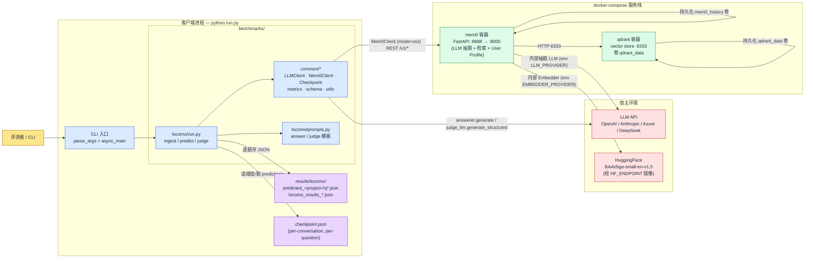

# memory-benchmarks · 系统图与时序

> 本图基于当前仓库(`benchmarks/locomo/run.py`、`benchmarks/common/*`、`docker-compose.yml`)生成。  
> 重点:**LOCOMO 评测流水线**(`async_main`)。其他 benchmark(`longmemeval`、`beam`)共用 `benchmarks/common/*` 的客户端,但调度各自独立。

---

## 1. 系统上下文 / 组件图(Component Diagram)



### 1.1 关键依赖清单

| 组件 | 来源 | 角色 | 状态 |
|---|---|---|---|
| `LLMClient` | `common/llm_client.py` | 项目直接调的 LLM(answerer + judge),支持 OpenAI / Anthropic / Azure | 客户端 |
| `Mem0Client` | `common/mem0_client.py` | 包装 mem0 REST;`mode=oss` → 自建,`mode=cloud` → Mem0 平台 API | 客户端 |
| `Checkpoint` | `common/utils.py`(推测位置) | 写入 `checkpoint.json`,支撑 `--resume` | 客户端 |
| `docker-compose.yml` | 顶层 | 编排 `mem0` + `qdrant` 两个容器 | 部署 |
| `mem0_history` volume | docker-compose | Mem0 的事实抽取历史回放 | 部署 |
| `qdrant_data` volume | docker-compose | 向量存储 | 部署 |

### 1.2 不在主线上的旁路(benchmarks/ 下其它目录)

- `benchmarks/longmemeval/`、`benchmarks/beam/`:复用同一套 `common/*` 客户端,但各自有独立的 `run.py` / `prompts.py`,**不与 locomo 共享调度**。下面时序图只画 LOCOMO 一条线。

---

## 2. LOCOMO 主时序(默认运行:`python run.py …`)

> 三阶段流水线:**Ingest → Predict → Judge**,每个 question 单独落盘支持断点续跑。  
> 主要函数入口:`async_main()`(第726行)→ 并发 `process_conversation()`(第859行)。

```mermaid
sequenceDiagram
    autonumber
    actor U as CLI
    participant Main as async_main<br/>(locomo/run.py)
    participant Ckpt as Checkpoint<br/>(common/)
    participant LLM as LLMClient<br/>(answerer / judge)
    participant M0 as Mem0Client
    participant API as mem0 :8888
    participant QD as qdrant :6333
    participant FS as results/locomo/<br/>predicted_&lt;proj&gt;/

    U->>Main: python run.py --project-name X ...
    Main->>Main: parse_args → cutoffs / categories / conv_indices
    Main->>FS: mkdir predicted_X
    Main->>Main: download_dataset / load_dataset (locomo10.json)
    alt args.with_evidence
        Main->>Main: load_evidence_lookup(path)
    end
    Main->>LLM: new LLMClient(answerer_model, judge_model, rpm)

    loop conv_idx ∈ conv_indices (并发,上限 max_workers)
        Note over Main,FS: --- 阶段 A · Ingest ---
        Main->>Ckpt: is_complete(key, CHUNK_SIZE=1)
        alt 未完成
            Main->>Main: ingest_conversation(...)
            loop session in sorted_sessions
                Main->>Main: session_to_chunks(turns)
                loop chunk in chunks
                    Main->>M0: add(messages, user_id, ts=epoch)
                    M0->>API: POST /memories (LLM 抽取事实)
                    API->>API: LLM 拆解 turn → 原子事实
                    API->>QD: upsert vector (+ graph / kv)
                    QD-->>API: OK
                    API-->>M0: memory_id
                    M0-->>Main: result
                    Main->>Ckpt: chunks_already_done.add(chunk_key)
                    Main->>Ckpt: save_progress(...)  %% 断点
                end
            end
            Main->>Ckpt: save_complete(key, {...})
        else 已完成
            Ckpt-->>Main: cp_data (user_id, total_chunks_processed)
        end

        Note over Main,FS: --- 阶段 B · Predict(各 Q 互不阻塞) ---
        Main->>API: GET /users/{user_id}/profile (可选 --user-profile)

        loop qi, qa ∈ conv_questions
            Main->>Main: process_question(...)
            Main->>M0: search(query, user_id, top_k)
            M0->>API: POST /search
            API->>QD: vector search (k=top_k)
            QD-->>API: hits
            API-->>M0: memories[]
            M0-->>Main: memories

            Main->>LLM: answerer.generate(user=gen_prompt)
            LLM-->>Main: generated_answer (前缀 "ANSWER:")

            Main->>FS: save q*.json (cutoff_results)

            opt 启用 judge 且未 predict-only
                loop cutoff ∈ cutoffs
                    Main->>LLM: judge_llm.generate_structured(prompt)
                    Note right of LLM: 已有 evidence 时<br/>走 get_judge_prompt_with_evidence
                    LLM-->>Main: {category, correct, explanation}
                    Main->>FS: 写回 cutoff_results[i]
                end
            end
        end
    end

    Note over Main,FS: --- 阶段 C · Aggregate ---
    Main->>FS: glob predicted_X/*.json
    Main->>Main: compute_locomo_metrics(all_evaluations, cutoffs)
    Main->>U: display_results(metrics, cutoffs)
    opt 统一输出
        Main->>FS: 写 locomo_results_&lt;ts&gt;.json
    end
```

### 2.1 关键控制点

- **断点续跑**:`--resume`(第843行)在 `async_main` 入口扫描 `predicted_*/q*.json`,把所有存在的结果装载进 `existing_ids`,内层 `process_conversation` 第911行 `if qid in existing_ids: continue` 跳过重复。Ingest 阶段另由 `Checkpoint` 控制,粒度到单个 chunk。
- **Graceful shutdown**(`shutdown = GracefulShutdown()`):每个 await 都 `if shutdown.requested: return`,让 Ctrl-C 后能从进度恢复。
- **`--predict-only`**:把 predict 阶段结果物化到磁盘后退出,**不调 judge**,便于跨次实验复用预测、调 Judge。
- **`--evaluate-only`**:**只跑 judge**,跳过 Mem0——要求 predict 产物已完整(否则直接拒绝执行,见第768–775行)。
- **并发模型**:
  - `conv_semaphore = asyncio.Semaphore(max_workers)` 控制会话级并发
  - `max_workers` 控制单会话内问题的并发(在 `process_question` 内部)

---

## 3. `--evaluate-only` 重跑 Judge 时序

> 适用场景:**同一组 predict 产物,换 Judge 模型 / 调 Judge prompt 重测**——只在最终目录里重写每个 `q*.json` 的 `cutoff_results` 字段。

```mermaid
sequenceDiagram
    autonumber
    actor U as CLI
    participant Main as async_main
    participant LLM as judge_llm
    participant FS as predicted_&lt;proj&gt;/q*.json

    U->>Main: python run.py --project-name X --evaluate_only [--rejudge]
    Main->>Main: 加载 dataset + evidence_lookup
    Main->>Main: 装载 answerer / judge_llm 客户端
    Main->>FS: glob *.json → 构造 expected_items

    Main->>FS: locomo_predict_outputs_complete(...)
    alt predict 未完整
        FS-->>Main: missing list
        Main-->>U: 拒绝继续执行,提示先跑 ingest+predict
    else predict 已完整
        FS-->>Main: complete=True
    end

    Main->>Main: print "Running judge phase (no Mem0)"
    Note over Main,LLM: asyncio.gather(judge_one(...)) · Semaphore(max_workers)

    loop qid ∈ expected_items (并发)
        Main->>FS: read qid.json
        alt 已有 cutoff_results 且未 --rejudge
            Main->>Main: skip
        else
            Main->>Main: apply_locomo_judge_to_saved_result(data, ...)
            loop cutoff ∈ cutoffs
                Main->>LLM: generate_structured(prompt)
                Note right of LLM: 有 evidence → with_evidence<br/>无 evidence → 走基础 prompt
                LLM-->>Main: {category, correct, explanation}
                Main->>Main: 写回 data.cutoff_results[i]
            end
            Main->>FS: save_result_json(path, data)
        end
    end

    Main->>Main: compute_locomo_metrics(all_evaluations, cutoffs)
    Main->>U: display_results + 写 locomo_results_&lt;ts&gt;.json
```

---

## 4. 数据落盘 Schema(便于读图)

```mermaid
classDiagram
    class PerQuestionResult {
        +string question_id  %% "conv0_q7"
        +int conv_idx
        +int qa_idx
        +string category    %% 1..5 (LOCOMO categories)
        +string generated_answer
        +list~CutoffResult~ cutoff_results
        +dict metadata      %% model / provider / ts / chat_id
    }
    class CutoffResult {
        +int cutoff         %% 10, 20, 50, 200 ...
        +list~Memory~ memories
        +bool correct
        +string explanation
        +string category    %% judge 标定的类别
    }
    class CheckpointProgress {
        +set~str~ completed_chunks    %% "{session}_c{idx}"
        +string user_id
        +int total_chunks_processed
    }
    class UnifyResult {
        +dict metadata
        +dict metrics_by_cutoff
        +list~PerQuestionResult~ evaluations
    }
    PerQuestionResult "1" --> "*" CutoffResult
    UnifyResult "1" --> "*" PerQuestionResult
```

---

## 5. 一句话总结

> **评测者**驱动 `locomo/run.py`,它用 `LLMClient` 调外部 LLM 做**回答 + 裁判**,用 `Mem0Client` 调本地 `mem0` 容器做**事实抽取 + 检索**,`mem0` 把向量存进 `qdrant`、自身历史落 `mem0_history` 卷。  
> **整条流水线分 Ingest / Predict / Judge 三阶段**,每 question 独立落 `predicted_*/q*.json`,**断点续跑粒度可到 ingest 的单 chunk**(由 `Checkpoint` 控制)和 predict 的单 question(由 `existing_ids` 控制),两套标志位让长跑评测可以多次被打断而不丢失进度。
