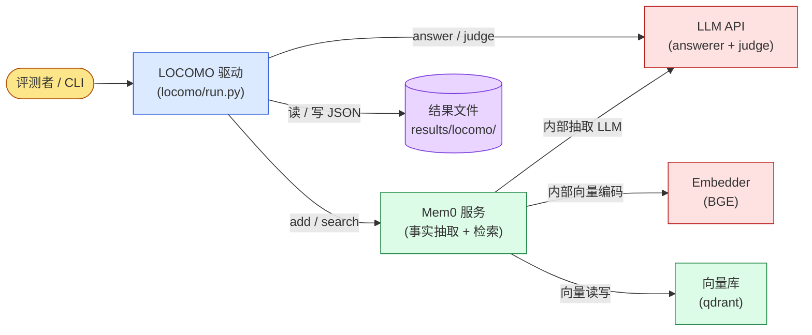
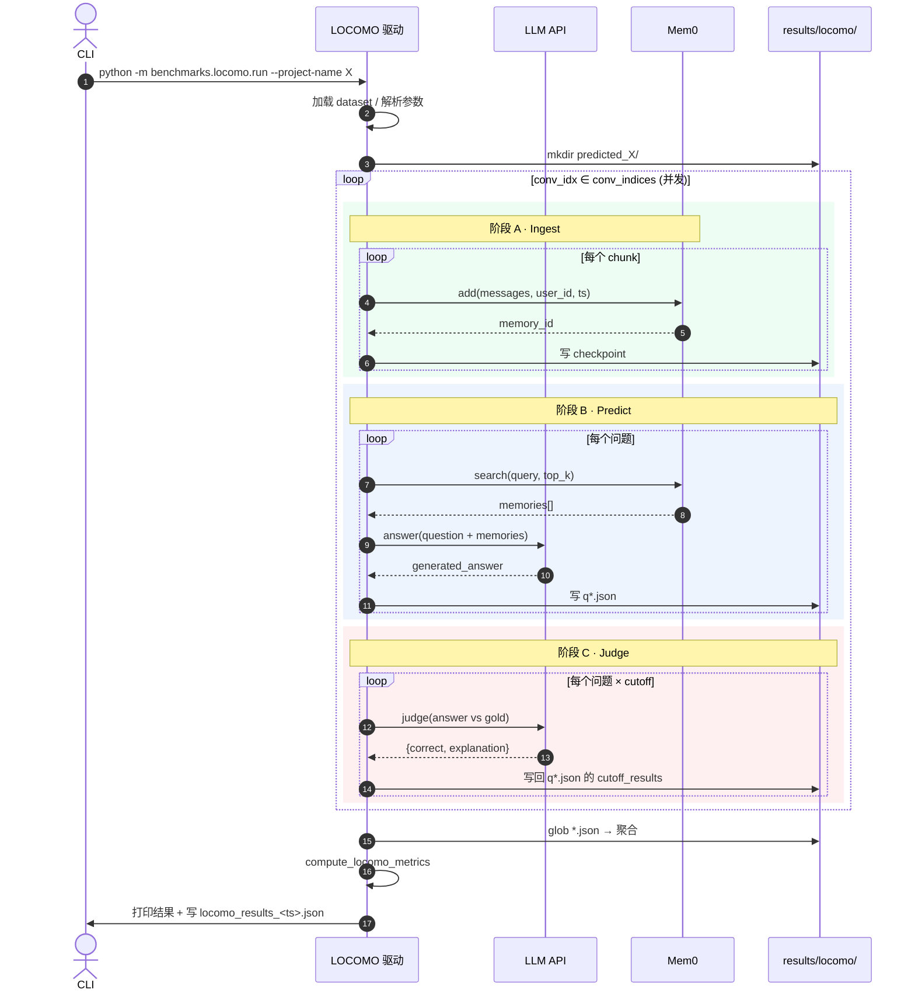
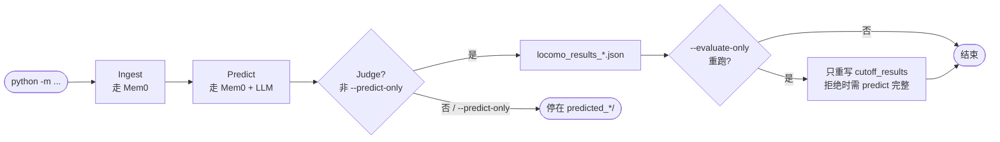
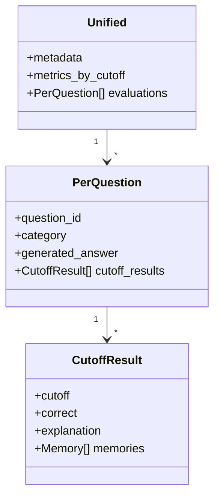

# memory-benchmarks · 系统图与时序

> 重点描述 **LOCOMO 评测流水线**(`python -m benchmarks.locomo.run …`)。  
> 内部模块、文件路径、端口号一律省去,把每个组件当黑盒看。

---

## 1. 组件图(谁跟谁说话)

**外部依赖只有 4 个**:`LLM API`(外部服务)、`Embedder`(HF BGE,只 mem0 内部用)、`Mem0` 自建服务(等价于"内嵌但独立部署的记忆后端")、`VecDB`(qdrant,Mem0 的存储后端)。Driver 不直接碰 Embed/VecDB,中间永远隔一层 Mem0。

---

## 2. 主时序(三阶段流水线)

> 入口:`async_main()` → 并发 `process_conversation()`(每 conv 一个协程,内含 Ingest → Predict → Judge)。

**三个阶段共享磁盘**:
- Ingest 写 `_checkpoint_*.json`(粒度到 chunk)
- Predict 写 `convN_qM.json`(粒度到 question)
- Judge 写回 `convN_qM.json` 的 `cutoff_results[]` 字段

这意味着 `--resume` 能从任意阶段、任意粒度恢复(`existing_ids` + `Checkpoint` 双保险),而 `--predict-only` / `--evaluate-only` 切的是**整段跳过**而非更细粒度。

---

## 3. 变体模式(一张图说清两个开关)

- **--predict-only**:跑完 Ingest + Predict 后退出,Judge 不跑。后续用 `--evaluate-only` 补判。
- **--evaluate-only**:**跳过 Mem0**,只读已有 `q*.json` 调 Judge,要求 predict 阶段已完整(否则直接 abort,见 `run.py:768`)。
- **--resume**:从已有 `q*.json` 重建 `existing_ids`,每题 `if qid in existing_ids: continue`。

---

## 4. 落盘 Schema

---

## 5. 一句话总结

> **Driver** 把每段对话拆 chunk 喂给 **Mem0**(顺带让 Mem0 调 **LLM** 抽事实、存到 **qdrant**),检索时从 Mem0 取回 memories 交给 **LLM** 回答,最后再用同一个 LLM 当裁判打分——**全部 LLM 调用都在离线评测阶段**,产物按 `predicted_*/q*.json` 落盘,可被 `--resume` / `--evaluate-only` 任意续跑。
